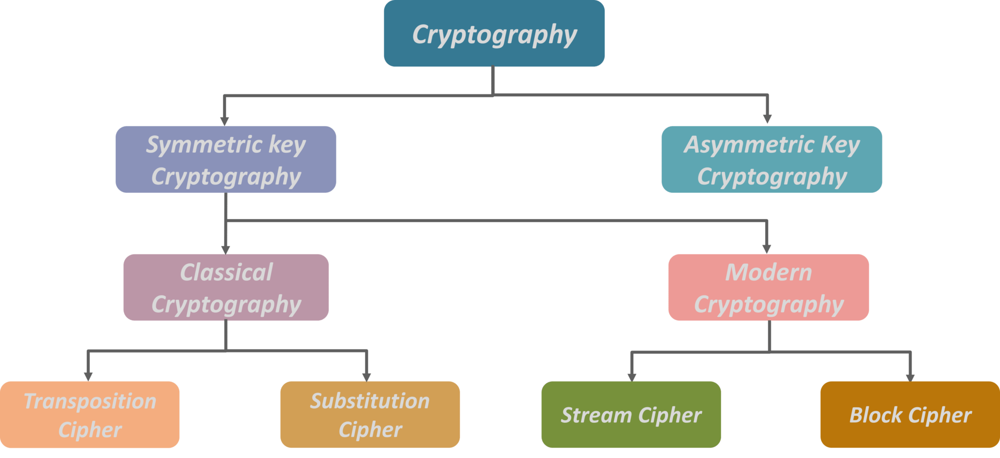

# Cryptography using Encryption Algorithms
 Cryptography is the technique of converting the data into a format which is not readable by an unauthorized user and thus allowing data to be transmitted without being decoded by unauthorized entities. The format in which the data is being transmitted after being converted by the encryption algorithm is known as **cypher text**. 

 ## Types of Encryptions
There are mainly two types of encryprion being used to do cryptography which are [`Symmetric`](https://www.cryptomathic.com/news-events/blog/symmetric-key-encryption-why-where-and-how-its-used-in-banking) and [`Asymmetric`](https://searchsecurity.techtarget.com/definition/asymmetric-cryptography) encryption.

 Figure No 1.1: Types of Encryptions

## Description of the Files
- The [`Keys`](https://github.com/Souradeep2304/Cryptography/tree/master/Keys) folder contains all the keys being used in order to execute the encryption and decryption.
- The [`Text Files`](https://github.com/Souradeep2304/Cryptography/tree/master/Text%20Files) folder contains both the original and the encrypted text files.
- The [`Report.pdf`](https://github.com/Souradeep2304/Cryptography/blob/master/Report.pdf) file describes the whole process of encrypton being followed.